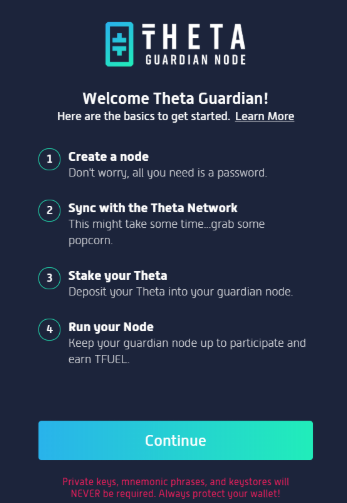
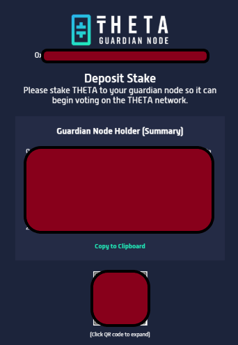
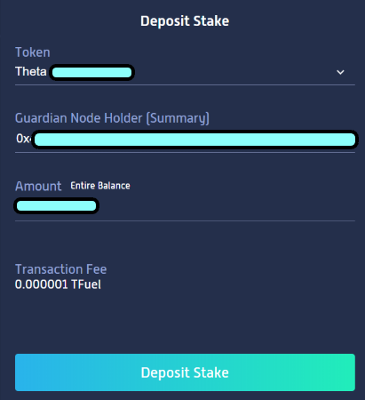
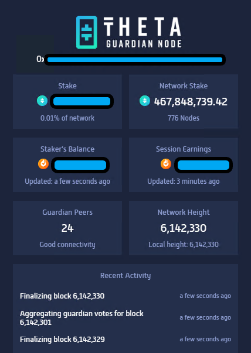
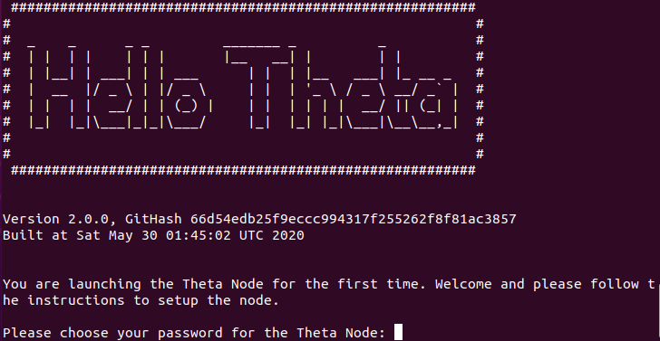

# Guide: How to stake THETA with a Guardian Node

## :checkered\_flag: 0. Prerequisites

* **Processor:** Quad cores or more
* **Memory:** 8GB RAM or more
* **Storage:** 256GB SSD or more
* **Internet:** 24/7 broadband internet connection 5 Mbps or more
* **Power:** 24/7 electrical power
* **THETA balance:** 10000 Theta or more

## :construction\_site: 1. Setting up your Guardian Node



### :robot:1. Create a Node

1. Download the Windows [binaries](https://api.thetatoken.org/downloads/guardian-node/windows?network=mainnet)
2. Run the binary
3. Click continue
4. Create your Guardian Node password
5. Click Create Node
6. When Windows asks, click Allow Access so the node can use internet.



### :gear:2. Sync your node

1. Sync your node to the tip of the blockchain can take minutes up to an hour depending on the performance of your computer.

### :money\_with\_wings:3. Deposit stake to your node

1. Once your node is fully synchronized, you will see a Guardian Node Holder (Summary). Copy and paste into your Theta wallet's "Deposit Stake" function.





### :white\_check\_mark: 4. Validate your node is working

Verify that

* the stake amount is correct
* there are some Guardian Peers connected
* Network Height number is increasing
* there is Recent Activity




:sparkles:Congratulations! Your Theta Guardian Node is working to finalize blocks and will earn TFUEL.



Every 10 minutes or 100 blocks, your Guardian node is rewarded TFUEL for it's work done. It may take up to half an hour before you see your first payout.



You can view your TFUEL rewards in your THETA wallet or view them on the [block explorer.](https://explorer.thetatoken.org/)




### ****:robot: **1.** Download and create a node

First install curl if you need to.

```
sudo apt install curl -y
```

Install Theta binaries. If you're using macOS, update the URLs so that os=macos

```
mkdir ~/theta-node && cd ~/theta-node
mkdir guardian
wget -O guardian/snapshot `curl -k https://mainnet-data.thetatoken.org/snapshot`
curl -k --output guardian/config.yaml `curl -k 'https://mainnet-data.thetatoken.org/config?is_guardian=true'`
curl -k --output theta `curl -k 'https://mainnet-data.thetatoken.org/binary?os=linux&name=theta'`
curl -k --output thetacli `curl -k 'https://mainnet-data.thetatoken.org/binary?os=linux&name=thetacli'`
chmod +x theta && chmod +x thetacli
```

### :gear: 2. Sync your node

```
cd ~/theta-node
./theta start --config=guardian
```

Choose a password.



Check the status of the sync.

Open a new terminal window with CTRL-SHIFT-T and check your sync status.

```
./thetacli query status
```


Sync your node to the tip of the blockchain can take minutes up to an hour depending on the performance of your computer.


### :money\_with\_wings: 3. Deposit stake to your node

Once your node is done syncing when **"syncing": false**, run the following to generate your Guardian Node Holder Summary.

```
./thetacli query guardian
```

&#x20;**Sample query guardian output:**

> `{ "Address": "0x5C...",` \
> `"BlsPubkey": "a1...",` \
> `"BlsPop": "az1...",` \
> `"Signature": "83201...",` \
> `"Summary": "0xeb..." }`

Copy and paste the **Summary** data into your wallet's "Deposit Stake" function

### :white\_check\_mark: 4. Validate your node is working

If you see the following logs, your node is working.

`DEBUG [guardian] Boardcasting guardian vote vote=AggregatedVotes`


:sparkles:Congratulations! Your Theta Guardian Node is working to finalize blocks and will earn TFUEL.



Every 10 minutes or 100 blocks, your Guardian node is rewarded TFUEL for it's work done. It may take up to half an hour before you see your first payout.



You can view your TFUEL rewards in your THETA wallet or view them on the [block explorer.](https://explorer.thetatoken.org/)



