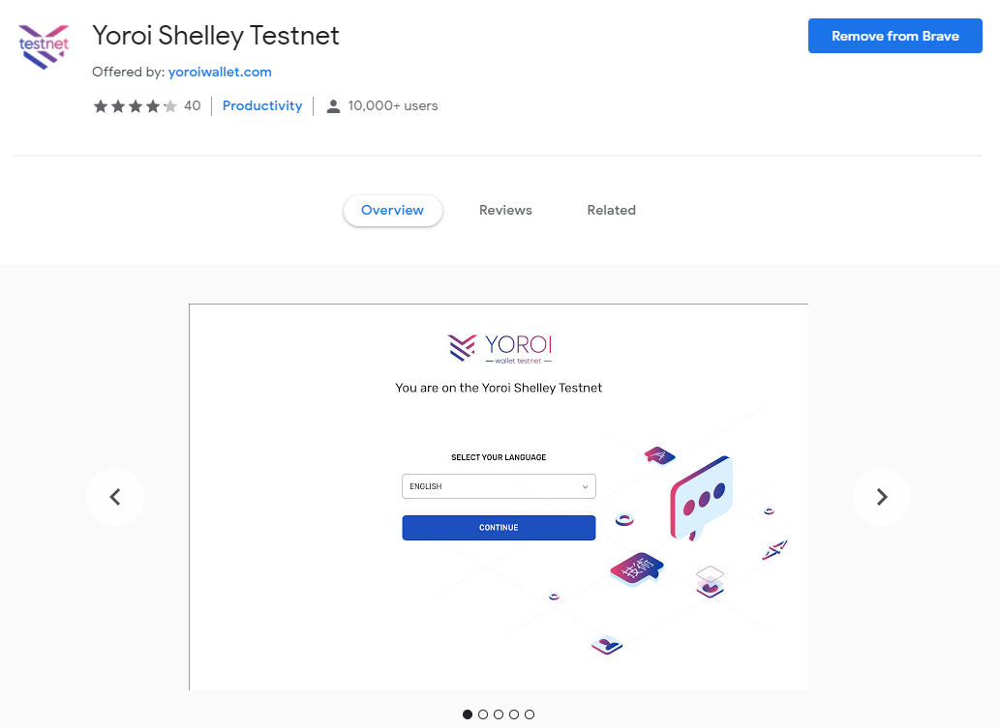

# Guide: How to stake ADA

## 🎊 Delegate your stake


If you had ada in a Daedalus or Yoroi wallet when the balance snapshot was taken at 12.00 UTC on November 29, 2019, you can participate. If not, you will need to wait until mainnet Cardano is upgraded to **Shelley**.


1. **Install** an official wallet from [Cardano.org](https://staking.cardano.org/en/delegation/)
2. Choice of **Daedalus** or **Yoroi**


Yoroi will be the quickest choice and is a lightweight wallet that runs in your browser or mobile phone.


For this example, we will delegate with Yoroi.

1. **Install** Yoroi from your app store
2. Click on the **Delegation \(Simple\) tab**
3. Search for a Stake Pool you would like to delegate to.


Easily find and browse Stake Pools at [PoolTool ](https://pooltool.io/)or [ADApools.org](https://adapools.org/)

Or watch this youtube video on [How to choose a good Cardano stake pool by Kaizen Crypto.](https://www.youtube.com/watch?v=tgxHfQy7CnU)


1. Click **Delegate**
2. Enter in your spending password
3. Click **DELEGATE** button
4. 🎉 Congratulations. Rewards will start showing up in 2 days, or epochs. Check your rewards on the **Dashboard tab**.

## 🔎 Monitoring your rewards

To learn more about your pool and their performance, use these amazing community created tools.

* [Cardano PoolTool](https://pooltool.io/) - The most comprehensive staking statistics for Cardano on the web
* [ADApools.org](https://adapools.org) - Independent cardano staking pool toplist
* [AdaStat ](https://adastat.net/en/)- Statistics for pool operators and ada holders

## 🤖 Telegram Bots for real-time alerts

* [AdaPoolsOrgBot ](https://t.me/AdaPoolsOrg_bot)on Telegram
* [PoolToolBot](https://t.me/PoolToolBot)on Telegram

